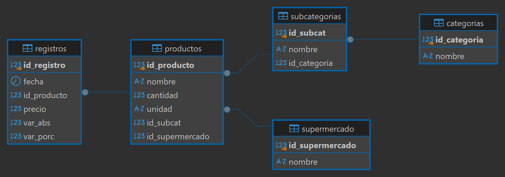
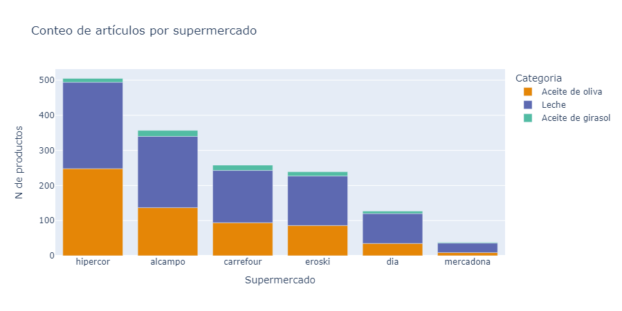
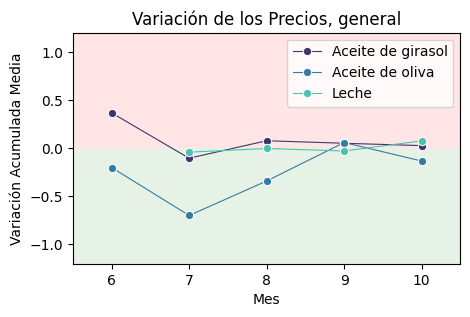
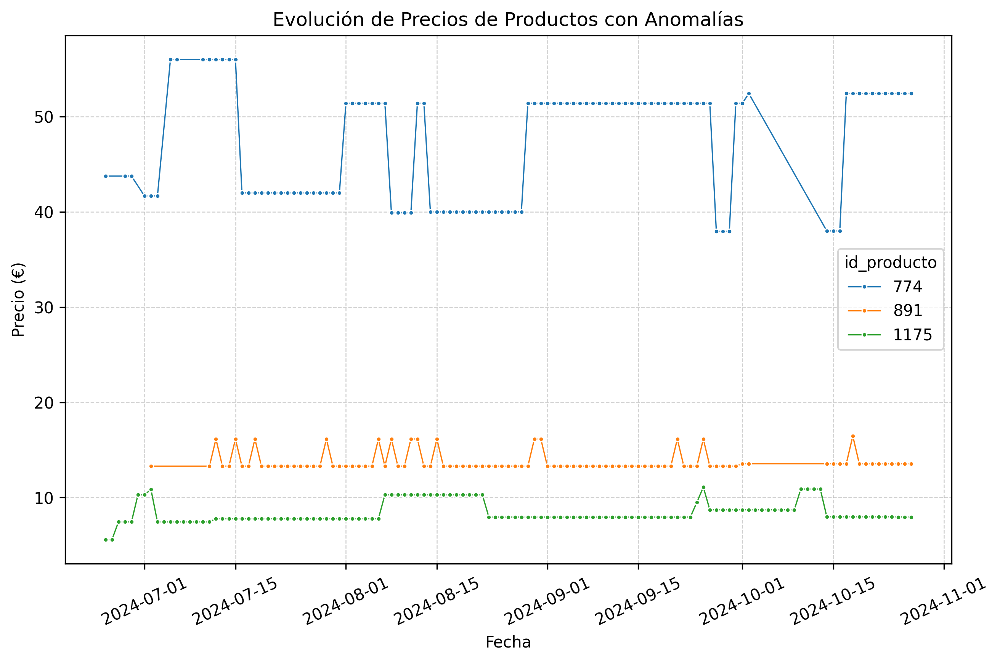
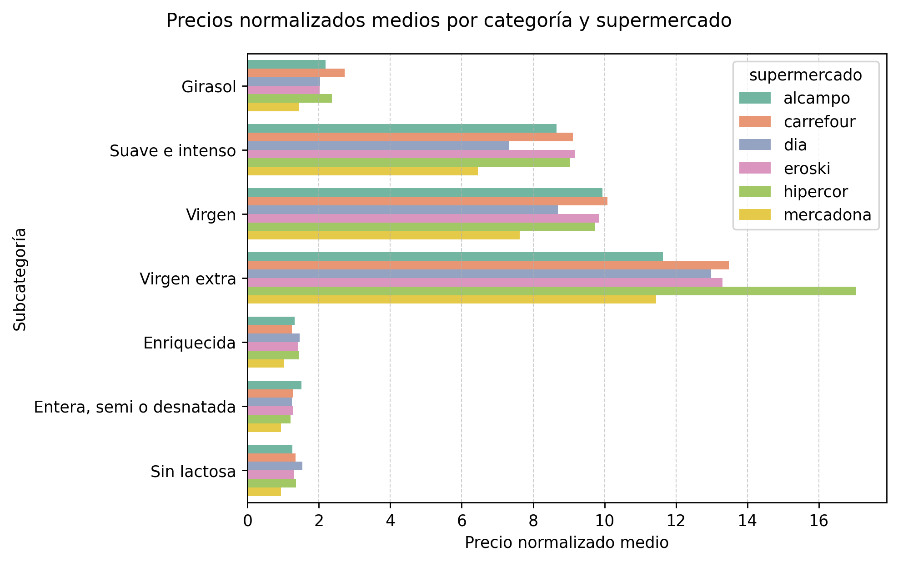

# Comparación y Análisis de Precios de Supermercados en España 🛒

## Descripción del Proyecto 📊

Este proyecto busca analizar la variabilidad y evolución de precios de productos básicos en seis grandes supermercados de España (Alcampo, Carrefour, Dia, Eroski, Hipercor y Mercadona) a partir de datos recolectados de la plataforma [FACUA: Precios Supermercados](https://super.facua.org/). FACUA ofrece datos actualizados diariamente sobre precios de productos, permitiendo a los usuarios comparar y observar fluctuaciones de precio. Aquí empleamos herramientas de scraping y procesamiento de datos para crear una base de datos en SQL, analizar la información y generar visualizaciones para obtener conclusiones claras sobre tendencias y prácticas de precios en los supermercados.

### Progreso del Proyecto 🚀

1. **Fase de Recolección de Datos**:
   - Se realizó scraping de la página de FACUA para extraer datos sobre precios de productos en diferentes supermercados.
   - Se recopilaron datos de productos como el nombre, precio, categoría y subcategoría.

2. **Limpieza de Datos**:
   - Se procesaron los datos recolectados para eliminar duplicados y entradas inconsistentes.
   - Se normalizaron los precios extrayendo la cantidad y la unidad de los nombres de productos, convirtiendo las cantidades a una unidad estándar (litros o gramos) para facilitar el análisis y comparación de precios.

3. **Creación de la Base de Datos**:
   - Se diseñó una base de datos en SQL para almacenar la información de precios y productos.
   - Se implementaron consultas para acceder y manipular los datos de forma eficiente.
   


4. **Análisis Exploratorio de Datos (EDA)**:
   - Se realizó un análisis exploratorio para identificar patrones y tendencias en los precios de productos.
   - Se generaron visualizaciones utilizando bibliotecas como `matplotlib`, `seaborn` y `plotly` para mostrar la variabilidad de precios entre supermercados.

## Estructura del Proyecto 🗂️
```
├── datos/                  # Archivos CSV y datos en crudo
│   ├── df_complete.csv      # Archivo csv con todos los datos recopilados
├── notebooks/              # Notebooks Jupyter para EDA y análisis específicos
│   ├── 1-scraping.ipynb    # Scrapeo de la web de facua
│   ├── 2-ddbb_creation     # Creación de la BBDD e inserción de valores
│   ├── 3-analysis          # Análisis de los datos y visualizaciones
├── scripts/                # Scripts de scraping y procesamiento de datos
│   ├── scraping_funcs.py   # Funciones para scrapeo
│   ├── query_funcs.py      # Funciones para ejecutar queries SQL desde python
│   ├── analysis_funcs.py   # Funciones usadas para el análisis de los datos
├── environment.yml         # Archivo de configuración para gestionar dependencias del entorno
└── README.md               # Documentación del proyecto
```


## Instalación y Requisitos ⚙️

Para configurar el entorno de desarrollo y asegurarte de que todas las dependencias necesarias estén instaladas, sigue estos pasos:

### Requisitos

- Python 3.7 o superior 🐍
- [Anaconda](https://www.anaconda.com/products/distribution) o [Miniconda](https://docs.conda.io/en/latest/miniconda.html) (opcional, pero recomendado)

### Paquetes Necesarios

El proyecto utiliza los siguientes paquetes:

- [`pandas`](https://pandas.pydata.org/pandas-docs/stable/): Para la manipulación y análisis de datos.
- [`numpy`](https://numpy.org/doc/stable/): Para operaciones numéricas y manejo de arrays.
- [`matplotlib`](https://matplotlib.org/stable/users/index.html): Para la visualización de datos.
- [`seaborn`](https://seaborn.pydata.org/): Para visualización estadística de datos.
- [`plotly`](https://plotly.com/python/): Para gráficos interactivos.
- [`tqdm`](https://tqdm.github.io/): Para mostrar barras de progreso en loops.
- [`psycopg2`](https://www.psycopg.org/): Para conectar Python con PostgreSQL.
- [`BeautifulSoup`](https://www.crummy.com/software/BeautifulSoup/bs4/doc/): Para el scraping de datos.
- [`requests`](https://docs.python-requests.org/en/latest/): Para realizar solicitudes HTTP sencillas.

### Instalación

1. **Clona el repositorio:**

   ```bash
   git clone https://github.com/yanruwu/Proyecto4-Analisis-Supermercados
   cd Proyecto4-Analisis-Supermercados
2. **Crea un entorno virtual:**

    Para crear el entorno de Conda, usa el siguiente comando:
    ```bash
    conda env create -f environment.yml
    ```
    O si prefieres usar venv:
    ```bash
    python -m venv venv
    source venv/bin/activate  # En macOS/Linux
    venv\Scripts\activate     # En Windows
    ```

## Conclusiones 📈

El análisis de precios de productos en diferentes supermercados proporciona insights valiosos sobre la estructura del mercado y el comportamiento de precios. A continuación, se destacan las principales conclusiones del estudio:

1. **Variedad de Productos**: 
   - Se observó que **Hipercor** ofrece la mayor variedad de productos en comparación con otros supermercados, lo que podría atraer a consumidores que buscan diversidad. Por el contrario, **Mercadona** muestra una oferta más limitada, lo que podría indicar una estrategia de simplificación en la compra para los consumidores.
   - La limitada información de secciones en la web de FACUA implica que estos resultados podrían ser indicativos de tendencias más amplias en la oferta de productos en cada supermercado.

   

2. **Valores Atípicos y Normalización de Precios**:
   - Se identificaron varios valores atípicos, especialmente en productos como aceites y leches. Estos atípicos fueron en gran medida consecuencia de la normalización de precios sin considerar el formato del empaque.
   - Por ejemplo, el precio de aceites de girasol y de oliva se disparó al analizar formatos pequeños, lo que sugiere que los consumidores deben tener en cuenta el tamaño del producto al comparar precios.


3. **Estabilidad de Precios**:
   - Los resultados revelan que varios supermercados presentan diferentes niveles de estabilidad en sus precios. Mientras algunos, como **Mercadona**, muestran una menor variabilidad en sus precios, otros supermercados tienen una mayor dispersión, lo que indica una estrategia de precios más diversificada.
   - La estabilidad de precios puede ser un factor decisivo para los consumidores que valoran consistencia, mientras que la mayor dispersión podría atraer a aquellos que buscan variedad y opciones.

   

4. **Tendencias en la Evolución de Precios**:
   - El análisis temporal reveló que los precios del aceite de oliva experimentaron una notable reducción tras la exención del IVA a finales de junio. Sin embargo, se detectaron prácticas engañosas, donde los precios se incrementaron momentáneamente para después ser marcados como rebajados.
   
   
   - Este comportamiento sugiere que los consumidores deben ser críticos al evaluar ofertas de precios, ya que pueden estar sujetas a manipulaciones de corto plazo.


   


5. **Comparación de Precios Promedio**:
   - La comparación de precios promedio reveló que Mercadona tiende a ofrecer precios más competitivos en la mayoría de las categorías de productos. Sin embargo, se identificaron anomalías en los precios de productos lácteos en supermercados como Dia y Alcampo, lo que puede haber distorsionado los resultados.
   - La inclusión de productos empaquetados sin un manejo adecuado en la limpieza de datos subraya la importancia de una correcta recolección y normalización de datos para asegurar conclusiones válidas.

   

En resumen, este análisis no solo proporciona una visión detallada sobre la estructura de precios y la oferta de productos en los supermercados, sino que también destaca la relevancia de la limpieza de datos y el análisis de precios ajustados por formato. Estos hallazgos pueden ser útiles para consumidores que buscan maximizar su poder adquisitivo y para supermercados que desean ajustar sus estrategias de precios.

## Próximos Pasos 🔍

1. **Revisión en la Recopilación de Datos**:
   - Realizar una revisión exhaustiva de los formatos de los productos para asegurar que la normalización de precios sea precisa y coherente. Esto incluye la identificación y corrección de errores relacionados con el tamaño y las unidades.

2. **Optimización en la Recopilación de Datos**:
   - Implementar técnicas de asincronía y paralelización en el scraping para mejorar la eficiencia y velocidad de la recolección de datos. Esto permitirá capturar datos de múltiples fuentes de manera más efectiva y reducir el tiempo de espera.

3. **Ampliar las Fuentes de Datos**:
   - Incorporar datos de más supermercados y otras plataformas de venta en línea para obtener una mayor variedad de productos y precios. Esto enriquecerá el análisis y proporcionará un panorama más completo del mercado.
## 🤝 Contribuciones
Las contribuciones son bienvenidas. Si deseas mejorar el proyecto, por favor abre un pull request o una issue.
